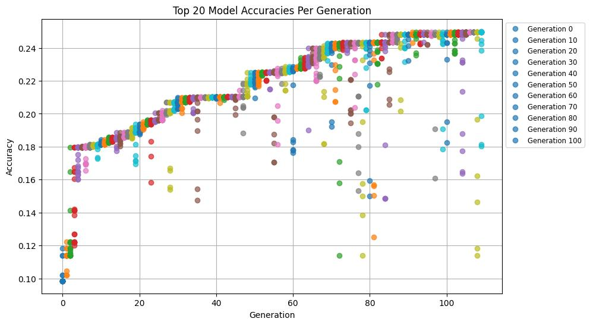

# CNN Mutation Test Project

## Overview

This project is an implementation of a **Convolutional Neural Network (CNN)** model generation, mutation, and evolution system. The goal is to generate multiple CNN models, mutate them over multiple generations, and evaluate their performance on the MNIST dataset.

The evolutionary algorithm involves:
- **Generating** a set of CNN models in the initial generation.
- **Mutating** models across generations to introduce randomness and improvements.
- **Evaluating** the models on their accuracy in recognizing digits from the MNIST dataset.
- **Evolving** models by selecting the best-performing ones and introducing mutations for the next generation.

At the end of each generation, the top 20 models are selected based on their accuracy. These models then undergo mutation, and the process continues for a specified number of generations.

## Project Structure

- **main.go**: The main implementation file for the CNN mutation test in Golang. It contains functions to generate, mutate, and evaluate models across generations.
- **main.py**: Python script used for analyzing and visualizing the accuracy progression across generations. This script loads model data, extracts accuracy metrics, and generates a graph of the top 20 models' accuracies per generation.
- **host/generations**: Folder that stores the models generated and mutated across different generations, organized by generation numbers.
- **host/generation_accuracy_graph.jpg**: An automatically generated graph showing the top 20 models' accuracies for each generation.

## How It Works

1. **Model Generation**: In the first generation, a specified number of CNN models are created with random weights, biases, and network structures.
2. **Model Mutation**: For each subsequent generation, models are mutated randomly by altering weights, biases, layers, and other network parameters. Mutations introduce diversity and provide a way for models to explore different configurations.
3. **Model Evaluation**: Each model is evaluated using the MNIST dataset, and the accuracy of the model is calculated.
4. **Model Evolution**: The top-performing models from each generation are selected and carried over to the next generation, where they are again mutated and evaluated. The process repeats for a specified number of generations.

## Running the Project

### Golang (CNN Mutation)
To run the CNN mutation test:
```bash
go run main.go
```

This will generate and mutate CNN models across multiple generations and save them in the host/generations folder.

## Python (Graph Generation)
After running the CNN mutation test, you can visualize the accuracy progression of the top 20 models across generations. Use the following command to run the Python script:

```bash
python main.py
```


## Example Graph
Below is an example of the accuracy graph generated by the Python script:

This will generate a graph and save it as generation_accuracy_graph.jpg in the root folder.




The graph shows the top 20 models' accuracies across different generations, providing a visual representation of the models' performance and the evolutionary process.


## Key Functions in the Golang Code
- **GenerateModels**: Creates a set of random CNN models and stores them in the host/generations/0 folder.
MutateAllModelsRandomly**: Applies random mutations to the models in a specific generation.
- **EvaluateModel**:  Evaluates the performance of a model by calculating its accuracy on the MNIST dataset.
- **EvolveNextGeneration**: Selects the top models from the current generation, applies mutations, and generates the next generation of models.

## Key Functions in the Python Code

- **load_models_accuracies**: Loads the models from each generation and extracts their accuracy.
- **collect_all_accuracies**: Collects and aggregates the top 20 models' accuracies from all generations.
- **Plotting**: The accuracies are plotted, with each generation's top 20 accuracies represented in the graph.

## Conclusion

This project demonstrates an evolutionary approach to improving CNN models over time through random mutations and selection. The visualization provides insights into how model performance evolves across generations, with the goal of increasing accuracy on the MNIST dataset.


### Key Points in the README:
- **Overview**: Gives a high-level description of the project and its purpose.
- **Project Structure**: Explains the key components in the folder.
- **How It Works**: Describes the generation, mutation, evaluation, and evolution process.
- **Running the Project**: Instructions for running both the Golang and Python scripts, and what each script does.
- **Graph Example**: Includes a reference to the generated graph (`generation_accuracy_graph.jpg`).
- **Key Functions**: Briefly outlines the important functions in both the Golang and Python code.

